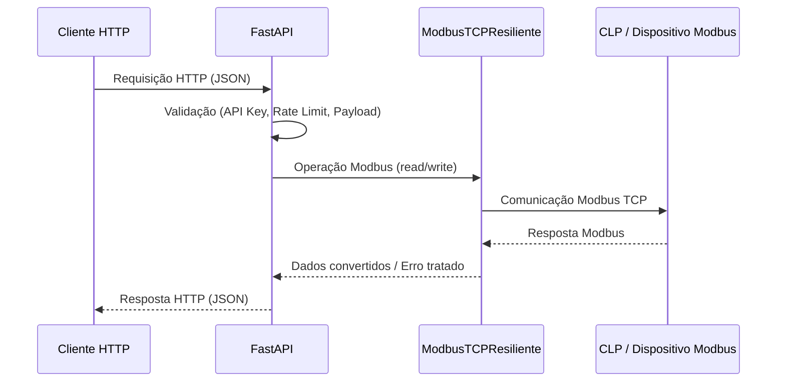

# Arquitetura

Esta seção descreve a arquitetura interna da Modbus API, explicando como os componentes interagem entre si para fornecer uma comunicação robusta, segura e padronizada com dispositivos Modbus TCP.

## Visão Geral

A Modbus API atua como uma camada intermediária entre clientes HTTP e dispositivos Modbus TCP.

O cliente não se comunica diretamente com o protocolo Modbus. Em vez disso, todas as operações passam pela API, que é responsável por:

* Autenticação e controle de acesso
* Validação de dados
* Gerenciamento de conexão Modbus
* Conversão de tipos e endianess
* Tratamento de falhas de comunicação

---

## Fluxo de Comunicação

---

## Componentes Principais

1. Cliente HTTP

    Pode ser:

    * Aplicação Web
    * Aplicação Mobile
    * Sistema SCADA
    * Script Python
    * Gateway industrial

    Responsabilidades:

    * Enviar requisições HTTP
    * Tratar respostas JSON
    * Não precisa conhecer Modbus

2. FastAPI (Camada HTTP)

    Responsável por:

    * Expor endpoints REST
    * Validar parâmetros e payloads (Pydantic)
    * Autenticar requisições via API Key
    * Aplicar rate limit
    * Padronizar respostas HTTP

    Exemplo de responsabilidades no código:

    * validate_api_key
    * SlowAPI
    * Pydantic Models
    * HTTPException

3. ModbusTCPResiliente (Camada Modbus)

    Classe responsável por toda a lógica Modbus TCP.

    Principais funções:

    * Abrir e manter conexão Modbus
    * Detectar conexão perdida
    * Reconectar automaticamente
    * Aplicar backoff exponencial
    * Executar leituras e escritas seguras
    * Converter tipos de dados (INT / UINT / FLOAT)
    * Tratar endianess
    * Cachear endereços inválidos

    Essa camada encapsula completamente o protocolo Modbus.

4. Dispositivo Modbus TCP

    Pode ser:

    * CLP
    * Inversor de frequência
    * Medidor de energia
    * Sensor industrial
    * Simulador Modbus
    
    A API se comunica utilizando:
    
    * Modbus TCP
    * Porta padrão 502
    * Unit ID configurável

---

## Gerenciamento de Conexão

A conexão Modbus é:

* Criada no startup da aplicação
* Reutilizada entre requisições
* Monitorada continuamente

Se ocorrer falha:

* A conexão é encerrada
* O tempo de retry aumenta (backoff)
* Uma nova tentativa é realizada automaticamente

Isso evita:

* Bloqueios da API
* Falhas permanentes
* Loops agressivos de reconexão

---

## Cache de Endereços Inválidos

Quando o dispositivo retorna exceções como:

* Illegal Data Address

A API:

* Marca o endereço como inválido
* Evita novas tentativas por um período configurável
* Reduz carga no CLP

Melhora o tempo de resposta da API

---

## Conversão de Tipos e Endianess

A API oferece uma camada de conversão automática:

Quantidade correta de registradores

Conversão para:

* Inteiros com ou sem sinal
* Ponto flutuante (32 e 64 bits)
* Controle total de endianess

Isso elimina erros comuns em integrações Modbus.

---

## Segurança na Arquitetura

A segurança é aplicada antes de qualquer acesso Modbus:

* API Key obrigatória
* Comparação segura contra ataques de timing
* Rate limit configurável
* CORS controlado

Nenhuma operação Modbus é executada sem validação prévia.

---

## Tolerância a Falhas

A arquitetura foi pensada para ambientes industriais:

* Falha de rede
* CLP offline
* Timeout
* Endereço inválido
* Conversão incorreta de dados

Em todos os casos:
* O erro é tratado
* A API não trava
* O cliente recebe resposta clara

---

## Conclusão

Esta arquitetura permite que sistemas modernos consumam dados industriais Modbus TCP de forma:

* Segura
* Escalável
* Resiliente
* Padronizada

Sem a complexidade do protocolo Modbus no lado do cliente.